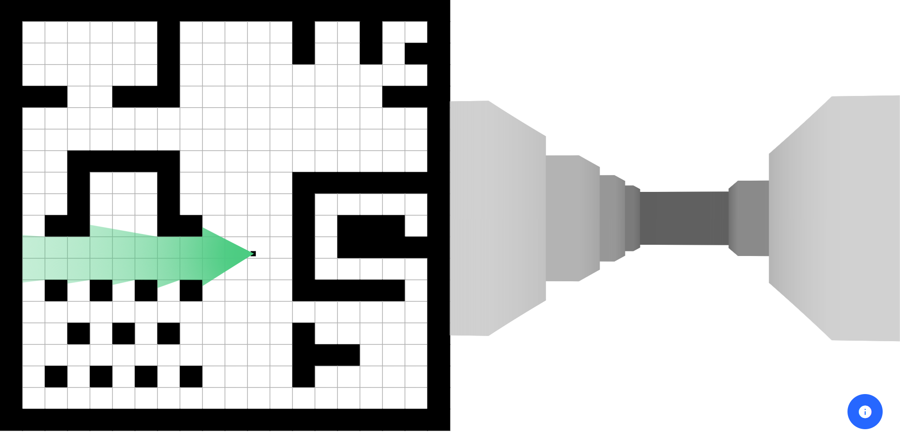

# Raycasting
Split screen [raycasting algorithm](https://lodev.org/cgtutor/raycasting.html) implementation with P5.js.
Left half of the screen visualize a 2D-grid, right half renders the visible grid portion in three dimensions.
Use `W`, `A`, `S`, `D` to turn and move around, the mouse wheel to adjust the field of view or click on any grid tile to toggle obstacles at any time.

### Live Demo
You can try out yourself the raycasting implementation [here](https://dvdmarchetti.github.io/experiments-raycasting/).

